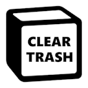

    

<h1 align="center">Notion Clear Trash</h1>

Browser extension that adds the much-needed clear trash button to Notion.
 
Now you can empty the whole trash with just one click.
 
 
<a href="https://example.com"><strong>Install extension »</strong></a>

    

## Installation
...

## Usage
To empty the trash, open the trash popup by clicking the "Trash" button in the sidebar on the left, as usual.
In the top right corner of the popup, you'll see a new button that says "Clear Trash".
Click that button and wait for the trash to be fully cleared. If you have thousands of items in the trash, this can take up to a few seconds.

## License
This software is licensed under the [MIT license](LICENSE).